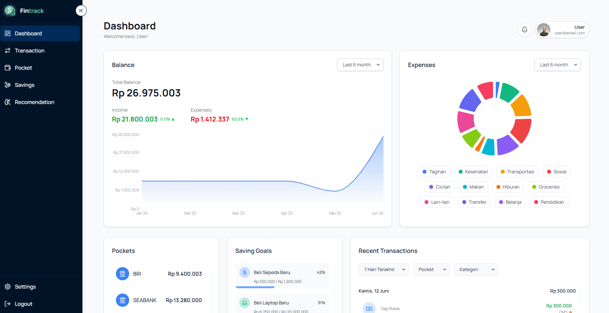
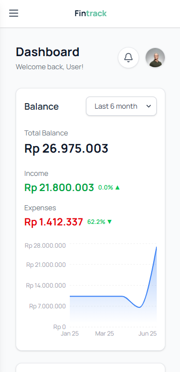

 FinTrack-Frontend

FinTrack-Frontend adalah aplikasi web yang dirancang untuk membantu Anda mengelola keuangan pribadi dengan efisien. Aplikasi ini dibangun menggunakan **React** dan **Vite**, menawarkan antarmuka yang responsif dan mudah digunakan.

---

## 🚀 Fitur

Aplikasi ini dilengkapi dengan berbagai fitur inti untuk pengelolaan keuangan pribadi:

- 🔐 **Autentikasi Pengguna**  
  Sistem login dan register yang aman untuk mengelola akun Anda.

- 📊 **Dashboard Keuangan**  
  Ikhtisar komprehensif tentang kondisi keuangan Anda, termasuk ringkasan saldo, total pengeluaran, dan grafik aktivitas keuangan harian.

  

- 💼 **Manajemen Dompet (Pockets)**  
  Kelola berbagai sumber dana atau kategori pengeluaran Anda.

- 💡 **Rekomendasi Keuangan**  
  Saran personal untuk membantu Anda membuat keputusan keuangan yang lebih baik.

- 🏦 **Tabungan (Savings)**  
  Lacak dan kelola tujuan tabungan Anda.

- ⚙️ **Pengaturan Akun**  
  Sesuaikan preferensi dan informasi akun Anda.

- 📜 **Riwayat Transaksi**  
  Lihat semua transaksi Anda untuk pelacakan yang mudah.

---

## 🗂️ Struktur Direktori

```
src/
  ├── App.jsx
  ├── main.jsx
  ├── index.css
  ├── assets/
  ├── config/
  │   └── apiConfig.js
  ├── pages/
  │   └── Auth/
  │       ├── login.jsx
  │       └── register.jsx
  └── components/
      ├── Dashboard/
      ├── Pockets/
      ├── Recomendation/
      ├── Savings/
      ├── Settings/
      ├── Sidebar/
      └── transaction/
public/
  ├── dashboard-preview.png
  ├── manifest.json
  ├── pwa-192.png
  └── pwa-512.png
```

---

## 🛠️ Instalasi

Untuk menjalankan FinTrack-Frontend secara lokal, ikuti langkah-langkah berikut:

1. Clone repositori:
   ```bash
   git clone https://github.com/username/fintrack-frontend.git
   cd fintrack-frontend
   ```

2. Install dependencies:
   ```bash
   npm install
   ```

3. Jalankan aplikasi:
   ```bash
   npm run dev
   ```

4. Buka di browser:  
   Aplikasi akan berjalan di [http://localhost:5173](http://localhost:5173)

---

## ⚙️ Konfigurasi

Pastikan Anda mengatur endpoint API agar aplikasi dapat berkomunikasi dengan backend.

Edit file:
```javascript
// src/config/apiConfig.js
const API_BASE_URL = "http://localhost:5000"; // Ubah sesuai backend Anda
```

---

## 📱 Dukungan PWA

FinTrack-Frontend telah mengimplementasikan fitur **Progressive Web App (PWA)**, yang memungkinkan aplikasi dapat diakses seperti aplikasi native pada perangkat seluler:

  

- Dapat diinstal langsung ke home screen pengguna
- Mendukung mode offline (jika didukung oleh backend/service worker)
- Memiliki file manifest dan ikon khusus

Untuk pengalaman terbaik, gunakan browser modern seperti Chrome atau Edge.

## 🏗️ Build

Untuk membangun aplikasi siap produksi:

```bash
npm run build
```

Hasil build akan tersedia di direktori `dist/`.

---

## 📄 Lisensi

Proyek ini dilisensikan di bawah [Lisensi MIT](./LICENSE). Anda bebas menggunakan, memodifikasi, dan mendistribusikannya dengan syarat mencantumkan hak cipta dan lisensi.

---

## 🙏 Ucapan Terima Kasih

Proyek ini dikembangkan khusus untuk keperluan **Capstone FinTrack**. Terima kasih kepada semua pihak yang berkontribusi dalam pengembangan aplikasi ini.
